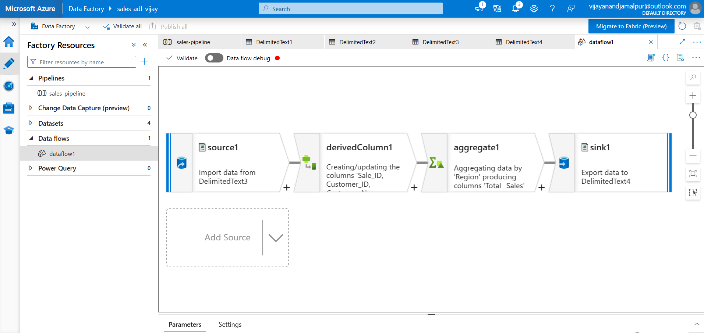
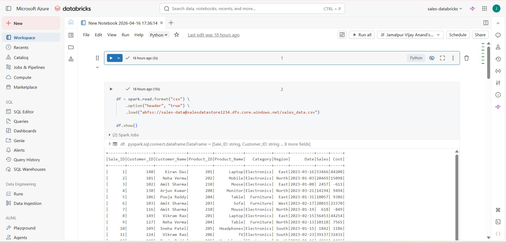
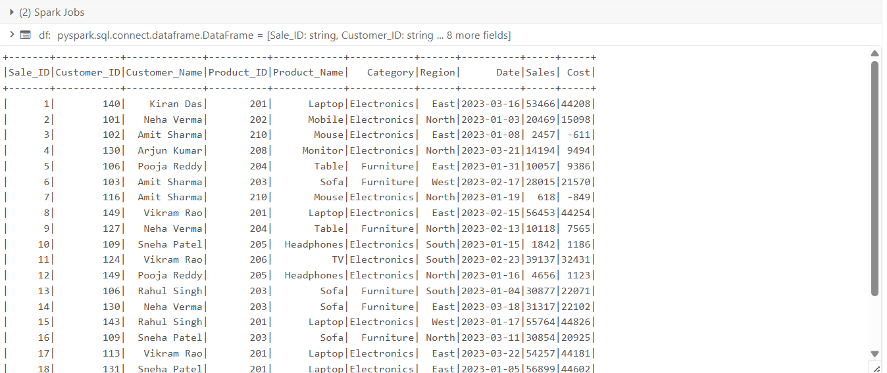
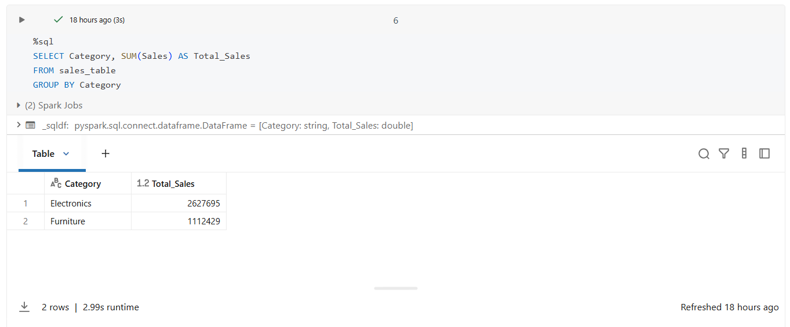
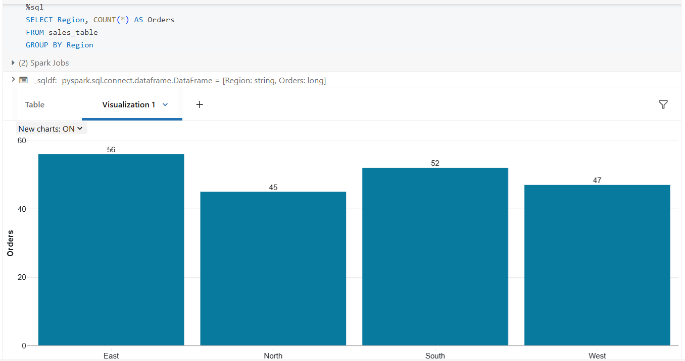
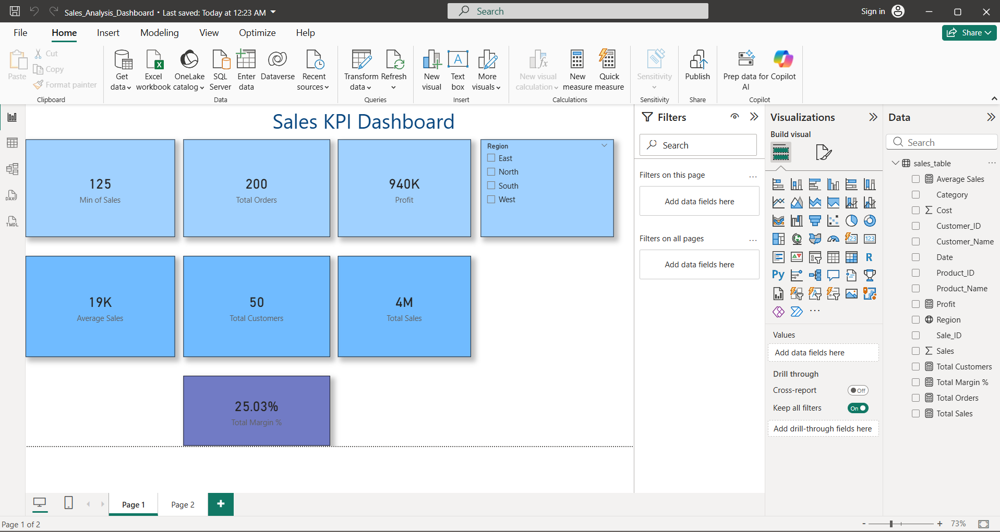
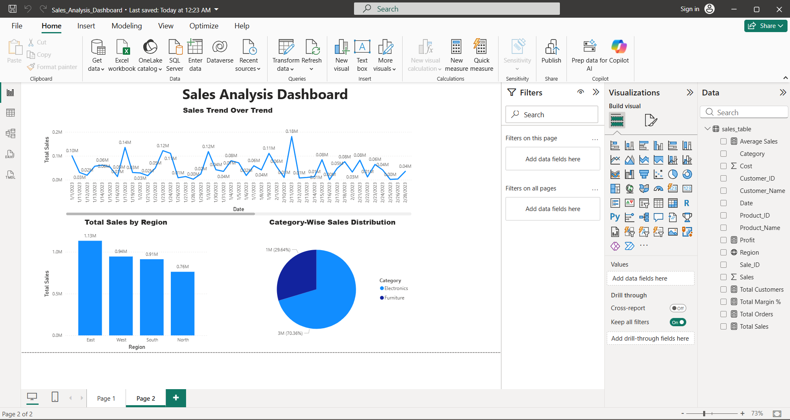

# 📊 Sales Analysis Dashboard (End-to-End Data Engineering Project)

## 📌 Project Overview

This project demonstrates an end-to-end data engineering pipeline using **Azure Data Factory, Azure Data Lake Storage, Databricks (PySpark), and Power BI** to process, transform, and visualize sales data for actionable business insights.

---

## ⚙️ Tech Stack

* Azure Data Factory (ADF)
* Azure Data Lake Storage (ADLS)
* Azure Databricks (PySpark + SQL)
* Power BI

---

## 🏗️ Architecture

ADF → ADLS → Databricks → Delta Table → Power BI

---

## 🔄 Data Pipeline Workflow

1. Data is ingested from source using Azure Data Factory
2. Data is stored in Azure Data Lake Storage
3. Data is processed and transformed using Databricks (PySpark)
4. Processed data is stored in Delta format
5. SQL queries are used for aggregations
6. Power BI dashboard is created for visualization

---

## 📸 Project Screenshots

### 🔹 ADF Pipeline

---

### 🔹 Databricks Processing

---

### 🔹 Power BI Dashboard

---

## 🚀 Key Features

* Category-wise sales analysis
* Region-wise order count
* Total sales aggregation
* End-to-end ETL pipeline
* Interactive Power BI dashboard

---

## 📂 Project Structure

* **ADF/** → Pipelines & datasets
* **Databricks/** → Notebooks (PySpark + SQL)
* **PowerBI/** → Dashboard (.pbix file)

---

## 📚 Key Learnings

* Built ETL pipeline using Azure Data Factory
* Processed large datasets using PySpark
* Created and managed Delta tables
* Designed interactive dashboards in Power BI

---

## 👤 Author

**Vijay Anand J**

---

